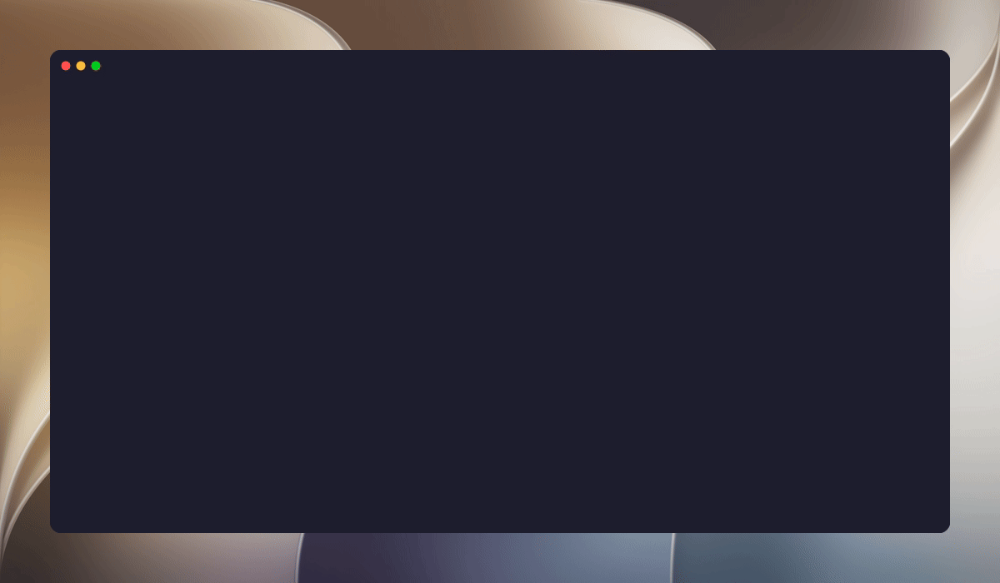

<p align="center">
  
</p>

<p align="center">
  <h1 align="center">⚡ ADX — Android Developer Experience CLI</h1>
  <p align="center">
    <strong>Making Android development effortless — eliminate the pain of messy Gradle and ADB commands.</strong>
  </p>
  <p align="center">
    Developed with ❤️ by <a href="https://github.com/Shashwat-CODING"><strong>Shashwat</strong></a>
  </p>
  <p align="center">
    <a href="https://github.com/Shashwat-CODING/adx/releases"></a>
    <a href="https://go.dev/"></a>
    <a href="https://github.com/Shashwat-CODING/adx/blob/main/LICENSE"></a>
    
  </p>
</p>

---

<p align="center">
  
</p>

---

```
           _       
  __ _  __| |_  __ 
 / _  |/ _  | \ \/ /
| (_| | (_| |  ><  
 \__,_|\__,_|/_/\_\
 android developer experience cli
```

---

## 💡 Why ADX?

Whether you are a **human developer** typing in your terminal or an **AI coding assistant** (like Claude Code, Codex, Antigravity, Cursor, or Aider) executing commands autonomously, Android development tooling is notoriously noisy, verbose, and friction-heavy.

**ADX** solves this by providing clean, fast, zero-config CLI primitives with first-class terminal UX for humans and deterministic machine-readable JSON & token savings for AI agents.

---

### 🤖 Why AI Coding Tools Love ADX (Massive Token & Cost Savings)

AI coding agents struggle with standard Gradle & ADB workflows because traditional tools dump thousands of lines of terminal noise that overflow LLM context windows and burn API tokens:

* **⚡ Up to 95% Token Savings**: Standard `./gradlew test` or raw `adb logcat` can dump 20,000+ tokens of passing lifecycle noise. `adx test --failed-only` and `adx crash` isolate *only* the failing assertion, root cause, and stack trace in under 300 tokens.
* **📦 Clean Machine-Readable Output (`--json`)**: Every core command supports `--json`, letting AI agents consume structured ASTs/JSON without fragile regex or shell text parsing.
* **🎯 Non-Interactive Autonomous Execution (`--auto-pick`)**: Avoids blocking prompts when multiple emulators/devices are connected by intelligently auto-selecting the active emulator.
* **🧠 Instant Root-Cause Attribution**: `adx crash` pinpoints the offending source file and exact line number, allowing AI assistants to jump straight to fixing the bug without multi-turn log exploration.
* **👁️ Instant Screen Hierarchy & UI Inspection (`adx layout dump --json`)**: Replaces heavy, XML-bloated `uiautomator dump` with a compact, structured JSON tree of interactive UI elements (`bounds`, `clickable`, `resource-id`, `text`), making automated UI verification instant for agents.

---

### 👨‍💻 Why Human Developers Love ADX

* **Zero-Config Simplicity**: No more memorizing esoteric `adb shell` parameters, port forward arguments, or Gradle daemon commands.
* **Interactive Device Selection**: Effortlessly target single or all connected physical phones and emulators.
* **Automated Dependency Injection**: `adx add <lib>` automatically finds latest versions on Maven Central and updates your Version Catalog (`libs.versions.toml`).
* **Clickable IDE Hyperlinks**: Output paths are formatted with clickable `file://` links to instantly open reports, screenshots, and source files in VS Code / Android Studio.
* **One-Command Troubleshooting**: Recover instantly from broken branch caches with `adx nuke` and kill stuck daemons with `adx kill`.

### The Problem vs. The Solution

| Developer Task | Traditional Android Workflow | With ADX | AI / Human Benefit |
|---|---|---|---|
| **Build & Deploy** | `./gradlew assembleDebug` + `adb install ...` + `adb shell am start ...` | `adx run` | One command replaces 3 steps |
| **Crash & ANR Analysis** | Grepping raw `logcat` through 5,000 lines of OS noise | `adx crash` / `adx trace` | 95% token savings & instant file:line mapping |
| **Unit Test Failures** | Gradle test runs printing hundreds of passing tests | `adx test --failed-only` | Compact failure summary with expected vs actual |
| **UI Screen Inspection** | Raw XML `uiautomator dump` | `adx layout dump --json` | Compact JSON of interactive elements |
| **Dependency Lookup** | Search browser ➜ find version ➜ edit catalog ➜ sync | `adx add <lib>` / `adx deps --find <lib>` | Instant Maven lookup & resolution path |
| **Corrupted Caches** | Build breaks after branch switch; manual folder deletes | `adx nuke` | One-shot deep clean |
| **Build Performance** | Guessing JVM settings and daemon status | `adx analyze-build` | Instant daemon & build-cache diagnostics |
| **Local API Proxying** | `adb reverse tcp:8080 tcp:8080` | `adx reverse 8080` / `adx port-forward` | Quick host & device socket forwarding |
| **Clean App Testing** | Manually clearing data in device Settings + granting perms | `adx run --clear-data --grant-permissions` | Clean, reproducible testing runs |

---

## 🚀 Installation

### Option 1: One-Line Installers

#### macOS & Linux (Terminal)
```bash
curl -fsSL https://raw.githubusercontent.com/Shashwat-CODING/adx/main/install.sh | bash
```

#### Windows (PowerShell)
```powershell
irm https://raw.githubusercontent.com/Shashwat-CODING/adx/main/install.ps1 | iex
```

---

### Option 2: Using Go

```bash
go install github.com/Shashwat-CODING/adx@latest
```
*Ensure `$GOPATH/bin` or `~/go/bin` is added to your shell's `PATH`:*
```bash
export PATH="$PATH:$(go env GOPATH)/bin"
```

---

### Option 3: Prebuilt Standalone Binaries

Download standalone precompiled binaries directly from [GitHub Releases](https://github.com/Shashwat-CODING/adx/releases):

| OS | Architecture | Download |
|---|---|---|
| **macOS** | Apple Silicon (M1/M2/M3/M4) | [Download tar.gz](https://github.com/Shashwat-CODING/adx/releases) |
| **macOS** | Intel (x86_64) | [Download tar.gz](https://github.com/Shashwat-CODING/adx/releases) |
| **Linux** | x86_64 | [Download tar.gz](https://github.com/Shashwat-CODING/adx/releases) |
| **Linux** | ARM64 | [Download tar.gz](https://github.com/Shashwat-CODING/adx/releases) |
| **Windows** | x86_64 (`adx.exe`) | [Download zip](https://github.com/Shashwat-CODING/adx/releases) |

#### Quick Manual Setup:
```bash
# Example for macOS Apple Silicon
tar -xzf adx_*_darwin_arm64.tar.gz
sudo mv adx /usr/local/bin/
```

---

### Option 4: Homebrew (macOS & Linux)

```bash
brew install Shashwat-CODING/tap/adx
```

---

### Option 5: Build From Source

```bash
git clone https://github.com/Shashwat-CODING/adx.git
cd adx
go build -o adx .
sudo mv adx /usr/local/bin/
```

---

## 📖 Command Reference

### 🛠️ Build & Run Workflows

#### Build APK
Builds debug or release APKs with a clean animated task spinner and clickable output links.
```bash
adx build                # Build debug APK
adx build release        # Build release APK
adx build -v             # Build with full verbose streaming logs
adx build debug --clean  # Clean before building
```

#### Run App (Build + Deploy + Launch)
Builds the APK, lets you select from connected physical devices or emulators, installs the APK, and launches the app.
```bash
adx run                  # Build debug, select target, install, and open app
adx run release          # Build release, install, and open app
adx run --no-build       # Skip rebuild, install and open existing APK
adx run -d emulator-5554 # Deploy to a specific device serial
```

#### Launch Emulator
Lists available Android Virtual Devices (AVDs). If only 1 exists, launches it immediately; if multiple exist, displays an interactive selector.
```bash
adx emulator             # Launch AVD
adx run emulator         # Alternative alias
adx emulator Pixel_8     # Launch specific AVD
```

---

### 📦 Dependency Management

#### Add Dependency
Searches Maven Central, finds the latest stable version, injects coordinates into your Version Catalog (`libs.versions.toml`) or `build.gradle[.kts]`, and downloads it with Gradle.
```bash
adx add retrofit
adx add coil-compose
adx add androidx.room:room-runtime
adx add hilt-compiler --config ksp
adx add junit --config testImplementation
```

#### Update Dependencies
Scans declared project dependencies, queries Maven Central for newer stable releases, and updates your project files.
```bash
adx update --check       # Preview available updates without editing files
adx update               # Update all dependencies and sync with Gradle
```

---

### 🧹 Cache & Daemon Troubleshooting

#### Nuke Corrupted Caches
Fixes corrupted Kotlin, KSP, and KAPT caches that break builds after switching branches.
```bash
adx nuke                 # Deletes .gradle/, all build/ folders, and stops daemons
```

#### Kill Rogue Daemons & Reset ADB
Terminates stuck Gradle/Kotlin daemons consuming 100% CPU/RAM and restarts the ADB server.
```bash
adx kill
```

#### Clean Build Outputs
Standard `./gradlew clean`.
```bash
adx clean
```

---

### 📱 Device & Media Utilities

#### Live App Logs
Streams real-time logcat output filtered strictly to your app's package ID and active process ID.
```bash
adx logs                 # Stream logs for current application
adx logs --clear         # Clear logcat buffer before streaming
adx logs -p com.pkg      # Stream logs for explicit package name
```

#### Screen Capture & Recording
Captures media directly from the device with IDE-clickable `file:///...` links.
```bash
adx screenshot           # Take screenshot (saves screenshot-<timestamp>.png)
adx screenshot bug.png   # Save to specific file
adx record demo.mp4      # Record screen video (press Ctrl+C to stop)
```

#### Deep Link Testing
Dispatches an `android.intent.action.VIEW` intent directly to the connected device.
```bash
adx open "myapp://details?id=42"
adx open "https://example.com/checkout"
```

#### Keystore Fingerprints (Firebase & Google APIs)
Extracts and displays MD5, SHA-1, and SHA-256 fingerprints from `~/.android/debug.keystore` (or custom keystores) in clean, copy-pasteable format.
```bash
adx sha
adx sha --keystore /path/to/release.jks --alias mykey --password secret
```

---

### 🔍 Diagnostics, Crashes & Testing

#### 💥 App Crash & ANR Summarizer (`adx crash` / `adx trace`)
Extracts recent crash or ANR stack traces from logcat, filters out OS noise, identifies the root cause, and provides clickable links directly to the offending file & line number.
```bash
adx crash                # Analyze recent crash/ANR
adx trace                # Alias
adx crash --json         # Machine-readable output for AI agents
adx crash --lines 500    # Scan deeper logcat buffer
```

#### 🧪 Unit Tests with Failure Summarizer (`adx test`)
Runs unit tests and isolates *only* the failing assertions with expected vs. actual values to save tokens and time.
```bash
adx test                 # Run tests with summary report
adx test --failed-only   # Print only failing test assertions (95% token savings)
adx test --summary       # Compact test suite results
adx test --json          # Pure JSON output of test suite results
```

#### 🌳 Dependency Explorer & Build Performance (`adx deps` & `adx analyze-build`)
Look up dependency trees, check for duplicate transitive libraries, and diagnose build-cache and daemon performance.
```bash
adx deps                 # View declared Version Catalog dependencies
adx deps --find coil     # Search entire transitive dependency graph
adx deps --tree          # Print full resolution tree via Gradle
adx analyze-build        # Instant build-cache & Gradle daemon diagnostics
adx analyze-build --json # Machine-readable build diagnostics
```

#### 📐 Screen Layout & Interactive UI Inspection (`adx layout` / `adx ui`)
Captures a live UI Automator dump and formats it as a colored tree or structured JSON.
```bash
adx layout dump --json   # Structured JSON view of interactive screen elements
adx ui --json            # JSON hierarchy
adx ui --filter Button   # Filter specific UI nodes on screen
adx ui --save screen.xml # Save raw XML hierarchy
```

#### 🌐 Port Forwarding & Reverse Proxying (`adx reverse` / `adx port-forward`)
Expose localhost backend APIs to your Android app or forward host socket connections.
```bash
adx reverse 8080         # Forward host localhost:8080 into Android app
adx reverse 3000 8080    # Custom port mapping (device:host)
adx port-forward 9222 9222 # Forward host port to device
```

---

### 🌐 Global Flags

| Flag | Description |
|---|---|
| `--json` | Emits machine-readable JSON for scripts and AI agents |
| `--auto-pick` | Auto-selects running emulator or first device non-interactively |
| `-d, --device <serial>` | Target a specific ADB device serial |
| `-C, --dir <path>` | Target Android project root directory (default `.`) |
| `-v, --verbose` | Stream full verbose Gradle / build logs |

---

### 🧰 All Other Commands
```bash
adx check-compat         # Validate Kotlin, Compose Compiler, AGP & Gradle compatibility
adx proxy set 192.168.1.5:8888 # Route device network traffic to Proxyman/Charles
adx proxy clear          # Clear proxy and restore direct device connection
adx proxy status         # Check active HTTP proxy on connected device
adx prefs dump           # Dump SharedPreferences XML files from app storage
adx db list              # List SQLite / Room databases inside app storage
adx db pull app.db       # Pull SQLite database from device to host machine
adx clear                # Clear app data & cache on device (Room, SharedPreferences)
adx uninstall            # Uninstall app from connected device(s)
adx stop                 # Force stop app process
adx devices              # List all attached devices and emulators
adx doctor               # Validate JDK, Android SDK, ADB, and Gradle wrapper
adx info                 # Inspect project root, module structure, and package ID
adx install app --open   # Auto-detect available APK (prefers release), install and open
adx install release --open # Install built release APK and launch it
adx bundle / adx aab     # Build Google Play App Bundle (.aab)
adx lint                 # Run Android Lint analysis with clickable report
adx analyse              # Full quality check: lint + tests + all static analysis
adx analyse :feature:x   # Analyse a specific module only
```

---

## ☕ Kotlin & Java Compatibility

`adx` is 100% compatible with both **Kotlin** and **Java** Android projects:
- **Kotlin DSL** (`build.gradle.kts`) and **Groovy DSL** (`build.gradle`) are both natively supported.
- **Gradle Version Catalogs** (`gradle/libs.versions.toml`) are detected and updated automatically.
- Multi-module and single-module project architectures are auto-detected without manual configuration.

---

## 🤝 Contributing

Contributions, issues, and feature requests are welcome!

1. Fork the Project (`https://github.com/Shashwat-CODING/adx`)
2. Create your Feature Branch (`git checkout -b feature/AmazingFeature`)
3. Commit your Changes (`git commit -m 'feat: add some amazing feature'`)
4. Push to the Branch (`git push origin feature/AmazingFeature`)
5. Open a Pull Request

---

## 👤 Author

Developed by **Shashwat**
- **GitHub**: [@Shashwat-CODING](https://github.com/Shashwat-CODING)
- **Repository**: [https://github.com/Shashwat-CODING/adx](https://github.com/Shashwat-CODING/adx)

---

## 📄 License

This project is licensed under the [MIT License](LICENSE).
